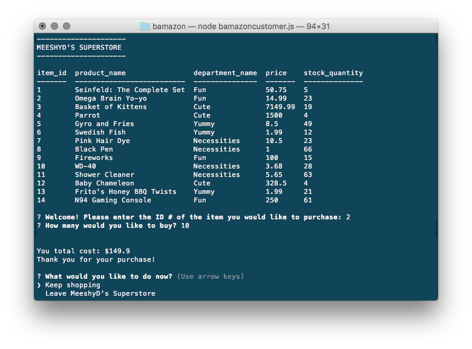
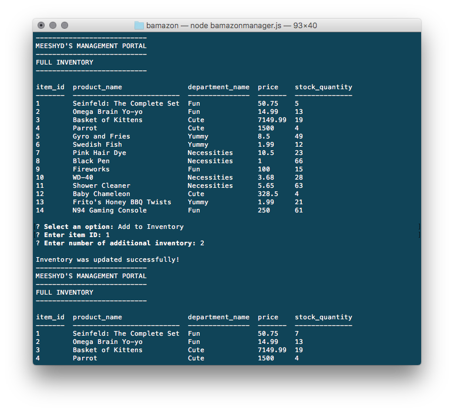

# Bamazon


## Synopsis

An interactive shopping node app where MySQL and Node.JS are used to allow users to purchase items, and allows managers to view, track and update the product inventory.

To run and use Bamazon, you will need to create a config.js file with the following:

```javascript
module.exports = {
  host: 'localhost',
  port: 3306,
  user: 'root',
  password: 'insertyourSQLpassword',
  database: 'Bamazon'
};
```

### Customer Portal

The Bamazon Customer Portal allows users to view the current items available for purchase. The user will be prompted to enter the item id# and how many items they wish to purchase. If the item is in stock, the order will be completed and the user will see the total amount of their purchase.


### Manager Portal

The Bamazon Customer Portal allows users to view and edit the inventory of the store. The user will be prompted to choose from the following options:

* View products for sale
* View low inventory
* Add to inventory
* Add a new product


## Technologies Used:

* JavaScript
* Node.js
* MySQL
* npm packages:
  * [mysql](https://www.npmjs.com/package/mysql)
  * [inquirer](https://www.npmjs.com/package/inquirer)
  * [console.table](https://www.npmjs.com/package/console.table)

## License

### Copyright 2017 Northwestern University Coding Bootcamp - Michelle Didier
